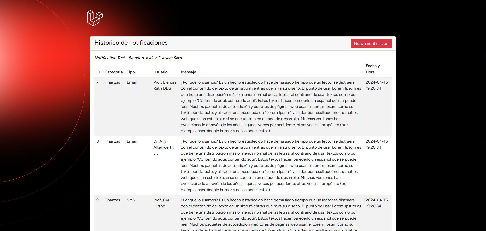
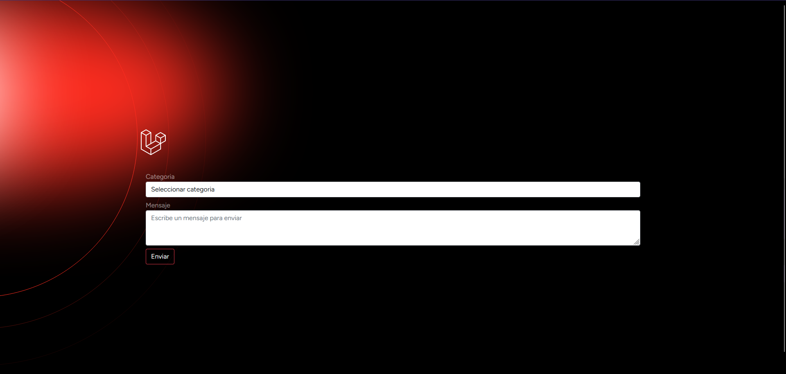

# Notification Test

### Sobre este proyecto

Se requiere crear un sistema de notificaciones, capaz de recibir un mensaje y dependiendo de la
categoría del mensaje y de los usuarios suscritos a estos, se notificará al medio que ellos eligieron.

Se manejarán 3 categorías de mensajes:

-   Deportes
-   Finanzas
-   Películas

Y se requiere enviar 3 tipos de notificaciones

-   SMS
-   Email
-   Push Notification

No se requiere que se envíe realmente ningún mensaje o se comunique con alguna API externa, solo
se registrará el envío de dicha notificación en un archivo de Logs o en base de datos.

## Pasos para implementar el proyecto

A continuación se detallan los pasos necesarios para implementar el proyecto:

1. **Clonar este repositorio**

        git clone https://github.com/brandonjgsdev/gila-notification-test.git

2. **Instalar paquetes:**

        composer install

3. **Hacer migraciones y ejecutar seeders:**

        php artisan migrate

        php artisan db:seed

4. **Correr la aplicacion:**

        php artisan serve
